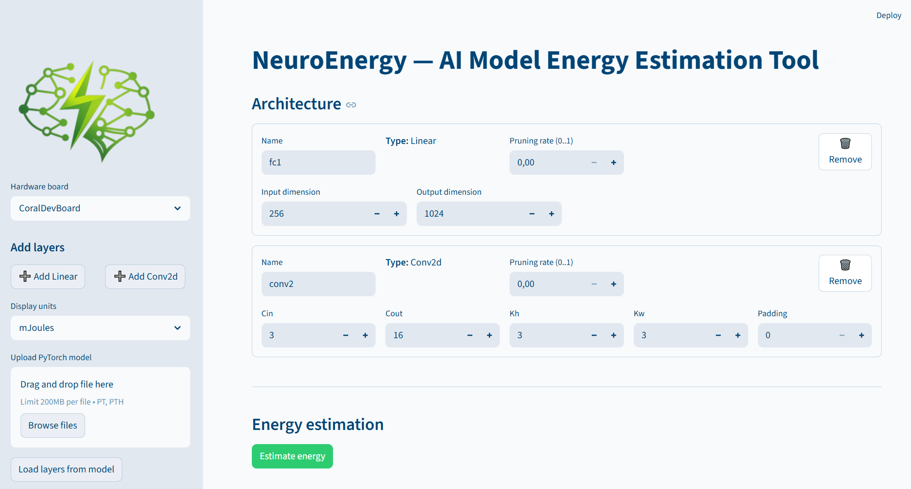

# NeuroEnergy — AI Model Energy Estimation Tool

A web platform for estimating the energy consumption of PyTorch neural networks on embedded hardware boards (Jetson Nano, Coral Dev Board). It combines real hardware measurements with bilinear interpolation to give accurate energy estimates for any layer configuration — including pruned models.

---

## Table of Contents

- [What it does](#what-it-does)
- [Project structure](#project-structure)
- [Screenshot](#screenshot)
- [How to install and run](#how-to-install-and-run)
- [How the logic works](#how-the-logic-works)
- [Web platform walkthrough](#web-platform-walkthrough)
- [Package API](#package-api)
- [Supported hardware and layers](#supported-hardware-and-layers)

---

## What it does

NeuroEnergy answers the question: **"How much energy will my neural network consume when running on embedded hardware?"**

Given a PyTorch model (or a manual list of layers), it estimates the energy (in Joules or millijoules) that each layer will consume on a target board. It accounts for:

- Layer type (Linear, Conv2d) and its dimensions
- Kernel size and padding for convolutional layers
- Pruning — how removing weights reduces energy consumption
- The non-linear relationship between layer size and energy (not just a linear scale)

---

## Project structure

```
energy_estimation/
├── app.py                    # Streamlit web application
├── requirements.txt          # All Python dependencies
├── logo/
│   ├── logo.png              # App icon and sidebar logo
│   └── neuroenergy.PNG       # Platform screenshot
└── .streamlit/
    └── config.toml           # UI theme (green accent, light background)
```

> The `energy_estimator` package is installed directly from GitHub (see installation below). It is **not** included as a local folder.
> Once installed, the package lives at:
> `.venv\Lib\site-packages\energy_estimator\`
> If you want to modify or debug the package locally, you can edit the files directly in that folder.

---

## Screenshot



---

## How to install and run

### Prerequisites

- Python 3.10 or later
- `uv` package manager (recommended) or standard `pip`

### 1. Install uv (if not already installed)

```bash
pip install uv
```

### 2. Create a virtual environment

```bash
uv venv .venv
```

Activate it:

**Windows:**
```bash
.venv\Scripts\activate
```

**macOS / Linux:**
```bash
source .venv/bin/activate
```

### 3. Install all dependencies

This installs everything in `requirements.txt`, including the `energy_estimator` package pulled directly from GitHub:

```bash
uv pip install -r requirements.txt
```

If you want to install only the core package manually:

```bash
pip install git+https://github.com/hi-paris/energy_estimator.git@main
```

### 4. Run the app

```bash
python -m streamlit run app.py
```

The app will open automatically in your browser at `http://localhost:8501`.

---

## How the logic works

### 1. Measured power tables

Energy values were measured on real embedded hardware by running specific layer configurations and recording average power draw. Results are stored as 2D matrices (Excel files):

- **Rows** → input dimension (number of input features or channels)
- **Columns** → output dimension (number of output features or channels)
- **Cell value** → measured energy in Joules

Each board has its own set of tables, and each layer type has its own table within that board.

### 2. Layer keys

Every layer type maps to a specific measurement table. For Conv2d layers, the kernel size and padding determine which file to use:

| Layer type | Layer key | Table file |
|---|---|---|
| `nn.Linear` | `linear` | `linear_power_report.xlsx` |
| `nn.Conv2d(kernel_size=3, padding=0)` | `conv_k3_p0` | `conv_k3_p0_power_report.xlsx` |
| `nn.Conv2d(kernel_size=3, padding=1)` | `conv_k3_p1` | `conv_k3_p1_power_report.xlsx` |
| `nn.Conv2d(kernel_size=5, padding=0)` | `conv_k5_p0` | `conv_k5_p0_power_report.xlsx` |
| `nn.Conv2d(kernel_size=5, padding=1)` | `conv_k5_p1` | `conv_k5_p1_power_report.xlsx` |

Not all layer keys are available on every board.

### 3. Bilinear interpolation

The measurement tables only contain data at discrete sizes (e.g. 64, 128, 256, 512 channels). For any arbitrary layer size, the package estimates energy by finding the 4 nearest measured points and interpolating between them:

```
Find the 4 surrounding grid points:
  (in_lo, out_lo) → Q11     (in_lo, out_hi) → Q12
  (in_hi, out_lo) → Q21     (in_hi, out_hi) → Q22

Compute fractional positions:
  tx = (in_dim  - in_lo)  / (in_hi  - in_lo)
  ty = (out_dim - out_lo) / (out_hi - out_lo)

Interpolate:
  R1 = Q11*(1-ty) + Q12*ty      ← interpolate along output axis at low input
  R2 = Q21*(1-ty) + Q22*ty      ← interpolate along output axis at high input
  E  = R1*(1-tx)  + R2*tx       ← interpolate along input axis
```

Values below the minimum measured size are clamped to the nearest edge. Values above the maximum measured size are **extrapolated** beyond the grid using the slope of the last interval. Each table is also anchored at **(0, 0) → 0 J**, meaning a fully pruned layer (zero active output neurons) correctly returns zero energy.

### 4. Pruning

When a pruning rate `p` is applied to a layer, some of its output neurons are removed. The effective output dimension is reduced, and the energy is re-estimated — **not just scaled**. This is more accurate because energy does not grow linearly with layer size.

```
eff_out = out_dim × (1 - p)

E_dense = estimate_energy(board, key, in_dim, out_dim)   # full model
E_used  = estimate_energy(board, key, in_dim, eff_out)   # after pruning
```

The platform shows both values side by side so you can see how much energy pruning saves.

### 5. Total energy

Per-layer energies are summed to produce the total estimate for the full model:

```
E_total = Σ E_used(layer_i)
```


---

## Web platform walkthrough

The app is divided into a **sidebar** (controls) and a **main area** (architecture editor + results).

### Sidebar

| Control | What it does |
|---|---|
| **Hardware board** | Select the target board (JetsonNano or CoralDevBoard) |
| **Add Linear** | Append a new fully-connected layer to the architecture |
| **Add Conv2d** | Append a new convolutional layer to the architecture |
| **Display units** | Switch between Joules and millijoules |
| **Upload PyTorch model** | Upload a `.pt` or `.pth` file |
| **Load layers from model** | Parse the uploaded model and populate the layer list automatically |
| **Clear architecture** | Remove all layers and start over |

### Architecture editor

Each layer appears as a card in the main area. You can edit all parameters inline:

**Linear layer fields:**
- `Name` — a label for the layer (e.g. `fc1`)
- `Type` — displayed as-is (`Linear`)
- `Input dimension` — number of input features
- `Output dimension` — number of output features
- `Pruning rate` — value from 0.0 (no pruning) to 1.0 (fully pruned)
- `Remove` button — deletes the layer

**Conv2d layer fields:**
- `Name` — a label for the layer (e.g. `conv1`)
- `Type` — displayed as-is (`Conv2d`)
- `Cin` — number of input channels
- `Cout` — number of output channels
- `Kh` — kernel height
- `Kw` — kernel width
- `Padding` — padding size (0 or 1 supported)
- `Pruning rate` — same as above
- `Remove` button — deletes the layer

### Model upload

Instead of adding layers manually, you can upload a saved PyTorch model:

1. Save your model's state dict: `torch.save(model.state_dict(), "model.pth")`
2. Upload the file via the sidebar
3. Click **Load layers from model**

The app scans all tensors in the state dict:
- 2D weight tensors (`shape = [out_features, in_features]`) → detected as **Linear** layers
- 4D weight tensors (`shape = [out_channels, in_channels, kh, kw]`) → detected as **Conv2d** layers

All other tensors (biases, batch norm stats, etc.) are ignored. Pruning rates are initialized to 0.0 for all loaded layers.

### Running the estimation

Click **Estimate energy** to run the estimation on all current layers. The app will:

1. Validate that each layer key is available on the selected board
2. Call `estimate_energy()` for each layer (once with full dimensions, once with pruned dimensions)
3. Display:
   - A **total energy metric** at the top
   - A **horizontal bar chart** showing per-layer energy consumption
   - A **line chart** showing cumulative energy through the network
   - A **table** with full details: type, name, input/output dim, pruning rate, dense energy, and used energy

---

## Package API

The `energy_estimator` package can also be used directly in Python without the web UI.

```python
from energy_estimator import list_boards, list_layer_keys, load_table, estimate_model_energy
from energy_estimator.layer_energy_interpolation import estimate_energy

# List available hardware boards
list_boards()
# → ["CoralDevBoard", "JetsonNano"]

# List available layer types for a board
list_layer_keys("JetsonNano")
# → ["conv_k3_p0", "conv_k3_p1", "conv_k5_p0", "conv_k5_p1", "linear"]

# Estimate energy for a single layer
energy = estimate_energy("JetsonNano", "linear", in_dim=512, out_dim=256)
print(energy)   # tensor in Joules

# Estimate energy for a full PyTorch nn.Module
import torch.nn as nn

model = nn.Sequential(
    nn.Linear(512, 256),
    nn.Linear(256, 128),
)

results = estimate_model_energy(model, board="JetsonNano")
print(results["total_energy"])   # scalar tensor in Joules
print(results["layers"])         # list of per-layer dicts

# Estimate with pruning masks (differentiable)
masks = {
    "0": torch.ones(256),   # all neurons active
    "1": torch.ones(128) * 0.5,  # soft mask
}
results = estimate_model_energy(model, board="JetsonNano", masks=masks)
results["total_energy"].backward()   # gradients flow through mask scores
```

---

## Supported hardware and layers

| Board | Linear | Conv k3 p0 | Conv k3 p1 | Conv k5 p0 | Conv k5 p1 |
|---|:---:|:---:|:---:|:---:|:---:|
| **JetsonNano** | Yes | Yes | Yes | Yes | Yes |
| **CoralDevBoard** | Yes | No | No | No | No |

Support for additional boards and layer types can be added by providing a new Excel measurement file in the package's `data/` directory.
